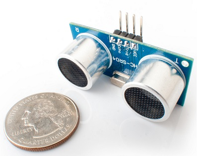
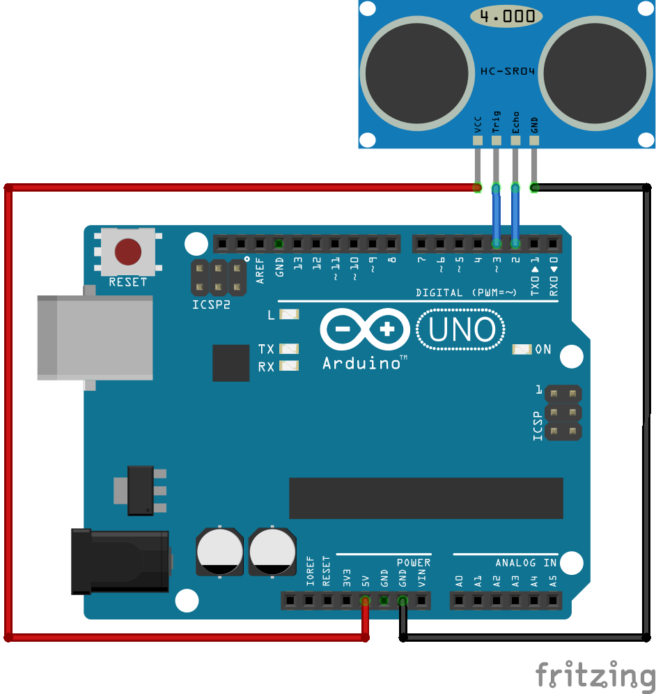

# Ultrasonic Proximity Sensor Library for Arduino

## What is it

This library (with example) is designed to be integrated in projects using ultrasonic proximity sensors.

It was tested with HC-SR04 device but it should be usable with equivalent sensors which have a trigger and echo pins.

## How to install

1) Download <a target="_blank" href="https://github.com/QuentinCG/Arduino-Ultrasonic-Proximity-Sensor-Library/releases/download/1.0.0/UltrasonicProximitySensor_v1_0_0.zip">latest release</a>

2) On your Arduino IDE, click "Sketch" menu and then "Include Library > Add .ZIP Libraries"

3) You can now use the library for your project or launch an example ("File > Examples")

## How to connect the sensor to your Arduino

|Ultrasonic proximity sensor|Arduino  |
|--------|--------                    |
|VCC|5V                               |
|GND|GND                              |
|Echo|D2 (or any other digital pin)   |
|Trigger|D3 (or any other digital pin)|

## Examples

One example is provided with this library:

### Show distance between the sensor and any element every second

<a target="_blank" href="https://github.com/QuentinCG/Arduino-Ultrasonic-Proximity-Sensor-Library/blob/master/UltrasonicProximitySensor/examples/ShowDistanceInSerial/ShowDistanceInSerial.ino">Link to source code</a>

## License

This project is under MIT license. This means you can use it as you want (just don't delete the library header).

## Contribute

If you want to add more examples or improve the library, just create a pull request with proper commit message and right wrapping.
